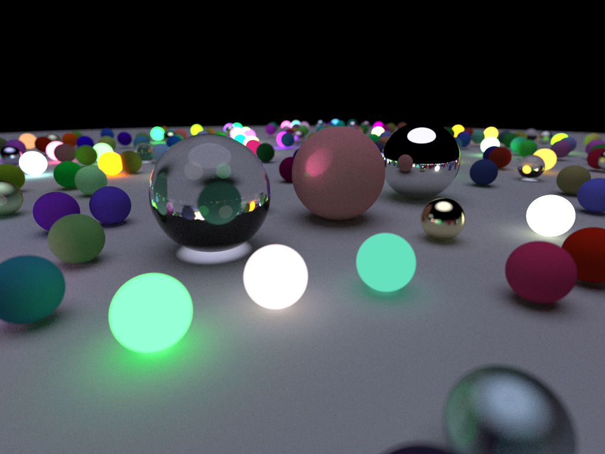

# HOLT 

This is my little Ray Tracing (or rather Path Tracing) project in which I'm learning more about this rendering technique by creating a software implementation in C++. 

Slowly expanding it in my free time.

## TODO
- [x] Read and implement the contents of [_Ray Tracing in One Weekend_](https://raytracing.github.io/books/RayTracingInOneWeekend.html)
- [ ] Speed up the rendering by moving it to GPU (Vulkan and compute shaders)
- [ ] Read and implement the contents of [_Ray Tracing: The Next Week_](https://raytracing.github.io/books/RayTracingTheNextWeek.html)
- [ ] Read and implement the contents of [_Ray Tracing: The Rest of Your Life_](https://raytracing.github.io/books/RayTracingTheRestOfYourLife.html)
## Project Config
You need to have [vcpkg](https://vcpkg.io/en/getting-started) and [CMake](https://cmake.org/install/) installed. Once that's done all that is needed to configure the project is to run:

```
cmake -B build -S . -DCMAKE_TOOLCHAIN_FILE=${PATH_TO_VCPKG}/scripts/buildsystems/vcpkg.cmake

```

and then simply to build it run:
```
cmake --build build
```

or simply import it to some IDE that supports CMake and vcpkg.

## Learning Resources:
- [Ray Tracing in One Weekend Series](https://raytracing.github.io) (Main Source)
- [Coding Adventure: Ray Tracing](https://youtu.be/Qz0KTGYJtUk)
- [Casual Shadertoy Path Tracing](https://blog.demofox.org/2020/05/25/casual-shadertoy-path-tracing-1-basic-camera-diffuse-emissive/)
- [ How Ray Tracing (Modern CGI) Works And How To Do It 600x Faster ](https://youtu.be/gsZiJeaMO48)
